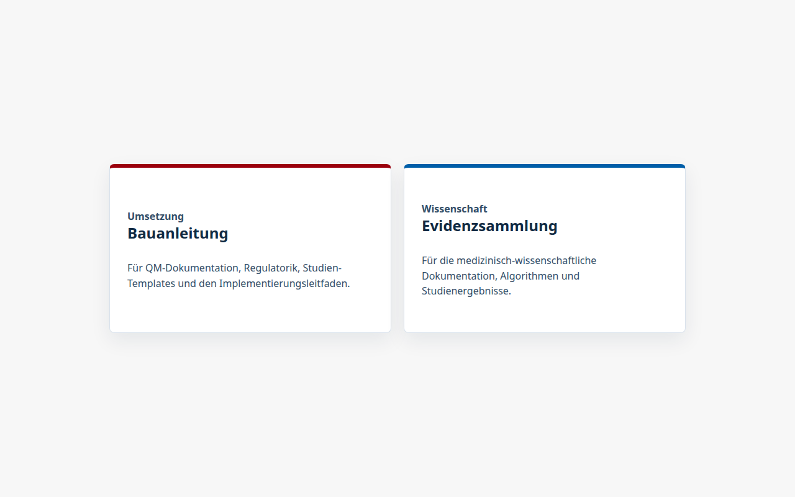
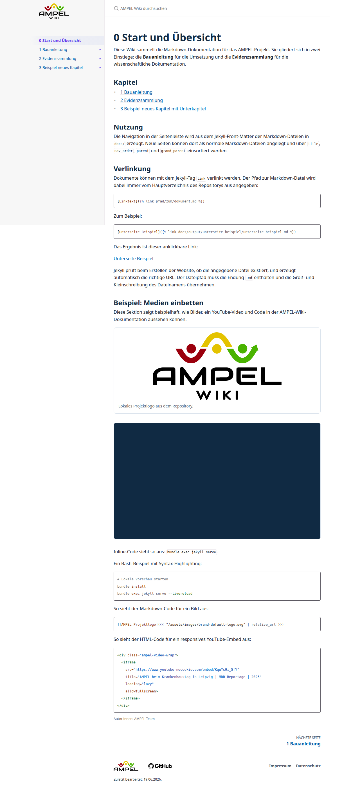

# AMPEL Wiki

Dieses Repository enthält einen einfachen GitHub-Pages/Jekyll-Aufbau für die AMPEL-Wiki-Dokumentation. Die Dokumentationsinhalte liegen getrennt im Ordner `docs/` und bleiben normale Markdown-Dateien; GitHub Pages baut daraus automatisch eine statische Website mit dem Jekyll-Theme Just the Docs.

## Screenshots

**Landing Page**



**Start und Übersicht – YouTube-Video und Code-Highlighting**



**Footer mit Seitennavigation und Logos**


## Warum Jekyll

GitHub Pages unterstützt statische Jekyll-Websites direkt. Dadurch braucht dieses Repository kein Node.js, kein npm und kein separates Dokumentationssystem wie MkDocs oder Docusaurus.

Just the Docs wird für GitHub Pages als fest versioniertes Remote-Theme eingebunden. Dadurch kann GitHub Pages die Website direkt aus dem Quell-Branch mit Jekyll bauen.

## Wichtige Dateien

- `_config.yml` konfiguriert Titel, Beschreibung, Theme, Basis-URL, aktivierte Suche und Jekyll-Plugins.
- `index.md` ist die reduzierte Landing Page mit den zwei Einstiegskacheln (Bauanleitung und Evidenzsammlung).
- `docs/0-start-und-uebersicht.md` enthält die Startseitenübersicht mit Kapitel-, Medien- und Codebeispielen.
- `docs/` enthält die Kapiteldateien und Unterordner mit den eigentlichen Markdown-Inhalten.
- `_sass/custom/custom.scss` enthält die einfachen Farb- und Layout-Anpassungen.
- `_includes/footer_custom.html` zeigt Autor:innen, erzeugt automatisch die vorherige und nächste Seite aus `doc_order` und enthält die Footer-Links.
- `Gemfile` definiert die Abhängigkeiten für lokale Builds.

## Markdown-Seiten

Jede Seite hat oben ein Jekyll-Front-Matter. Beispiel:

```md
---
title: 2.1 Technische Voraussetzungen
layout: default
parent: 2 Voraussetzungen für die Übertragung
nav_order: 1
doc_order: 3
last_modified_date: 2026-06-18
authors:
  - AMPEL-Team
---
```

Danach folgt normaler Markdown-Inhalt.

## Front-Matter-Properties

Die wichtigsten Properties pro Seite sind:

- `title` ist der sichtbare Seitentitel in Navigation und Browser.
- `layout` ist normalerweise `default`; die Startseite nutzt `home`.
- `nav_order` bestimmt die Reihenfolge in der Seitenleiste.
- `parent` ordnet eine Seite unter einer übergeordneten Seite ein.
- `grand_parent` wird bei tiefer verschachtelten Seiten genutzt.
- `has_children: true` markiert Übersichtsseiten mit Unterseiten.
- `doc_order` bestimmt die lineare Reihenfolge für "Vorherige Seite" und "Nächste Seite".
- `last_modified_date` wird im Footer als "Zuletzt bearbeitet" angezeigt. Format: `YYYY-MM-DD`.
- `authors` ist eine Liste von Autor:innen und wird im Footer angezeigt.
- `author` kann als einzelner Fallback-Wert genutzt werden; für neue Seiten ist `authors` empfohlen.
- `permalink` setzt bei Bedarf eine feste URL.
- `nav_exclude: true` blendet Seiten aus der Seitenleiste aus.

Beispiel für mehrere Autor:innen:

```md
---
title: Beispielseite
layout: default
nav_order: 7
doc_order: 28
last_modified_date: 2026-06-18
authors:
  - AMPEL-Team
  - CDS-Netzwerk
---
```

## Navigation

Just the Docs baut die Seitenleiste aus dem Front-Matter:

- `title` ist der sichtbare Name der Seite.
- `nav_order` bestimmt die Reihenfolge innerhalb derselben Ebene.
- `parent` ordnet eine Seite unter einer übergeordneten Seite ein.
- `grand_parent` wird für tiefere Ebenen genutzt.
- `has_children: true` markiert Übersichtsseiten mit Unterseiten.
- `doc_order` bestimmt die lineare Reihenfolge für die Links "Vorherige Seite" und "Nächste Seite".

Die Startseite `index.md` hat kein `doc_order`, damit sie nicht in der vorherigen/nächsten Seitennavigation erscheint.

## Neue Seite hinzufügen

1. Markdown-Datei im Ordner `docs/` anlegen, zum Beispiel `docs/2-voraussetzungen-fuer-die-uebertragung/2-4-neues-thema.md`.
2. Front-Matter einfügen:

```md
---
title: 2.4 Neues Thema
layout: default
parent: 2 Voraussetzungen für die Übertragung
nav_order: 4
doc_order: 6
last_modified_date: 2026-06-18
authors:
  - AMPEL-Team
---
```

3. `nav_order` passend zur Seitenleiste setzen.
4. `doc_order` passend zur linearen Lesereihenfolge setzen.
5. Links mit relativen Markdown-Pfaden schreiben, zum Beispiel `[Technische Voraussetzungen](2-1-technische-voraussetzungen.md)`.

## Neue verschachtelte Sektion hinzufügen

Eine Übersichtsseite mit Unterseiten bekommt `has_children: true`:

```md
---
title: 3.4 Neue Sektion
layout: default
parent: 3 Technische Aspekte zur Übertragung
nav_order: 4
has_children: true
doc_order: 22
last_modified_date: 2026-06-18
authors:
  - AMPEL-Team
---
```

Eine Unterseite darunter verweist auf diese Seite:

```md
---
title: 3.4.1 Unterthema
layout: default
parent: 3.4 Neue Sektion
grand_parent: 3 Technische Aspekte zur Übertragung
nav_order: 1
doc_order: 23
last_modified_date: 2026-06-18
authors:
  - AMPEL-Team
---
```

## Farben und Layout anpassen

Die Datei `_sass/custom/custom.scss` enthält zentrale Werte wie:

- `$ampel-background`
- `$ampel-text`
- `$ampel-link`
- `$ampel-sidebar-background`
- `$ampel-heading`
- `$ampel-content-width`

Diese Werte können angepasst werden, ohne das Theme selbst zu kopieren.

## Lokal ausführen

Ruby und Bundler müssen lokal installiert sein. Danach:

```bash
bundle install
bundle exec jekyll serve
```

Die lokale Vorschau ist dann normalerweise unter `http://localhost:4000/ampel-wiki/` erreichbar.

Für eine lokale Kopie, die direkt per Doppelklick auf `_site/index.html` funktioniert:

```bash
bundle exec ruby scripts/build-local-site.rb
```

## Auf GitHub Pages veröffentlichen

1. In GitHub unter `Settings` > `Pages` bei `Build and deployment` als Quelle `Deploy from a branch` wählen.
2. Als Branch `main` und als Ordner `/ (root)` auswählen und speichern.
3. Änderungen auf den Branch `main` pushen. GitHub Pages baut die Jekyll-Seite automatisch.

Die erwartete Projekt-URL ist:

```txt
https://ampel-cdss-org.github.io/ampel-wiki/
```
