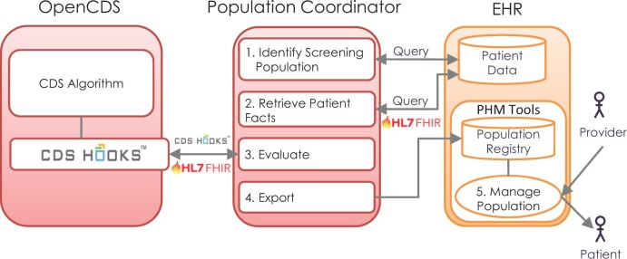

Dieses Markdown hat die folgenden Property Kopfzeilen:
```
---
title: 3 Beispiel neues Kapitel
layout: default
nav_order: 3
doc_order: 28 #<- ist die gobale Nummerieung aller beiträge
has_children: true 
last_modified_date: 2026-06-19
authors:
  - AMPEL-Team
---
```



